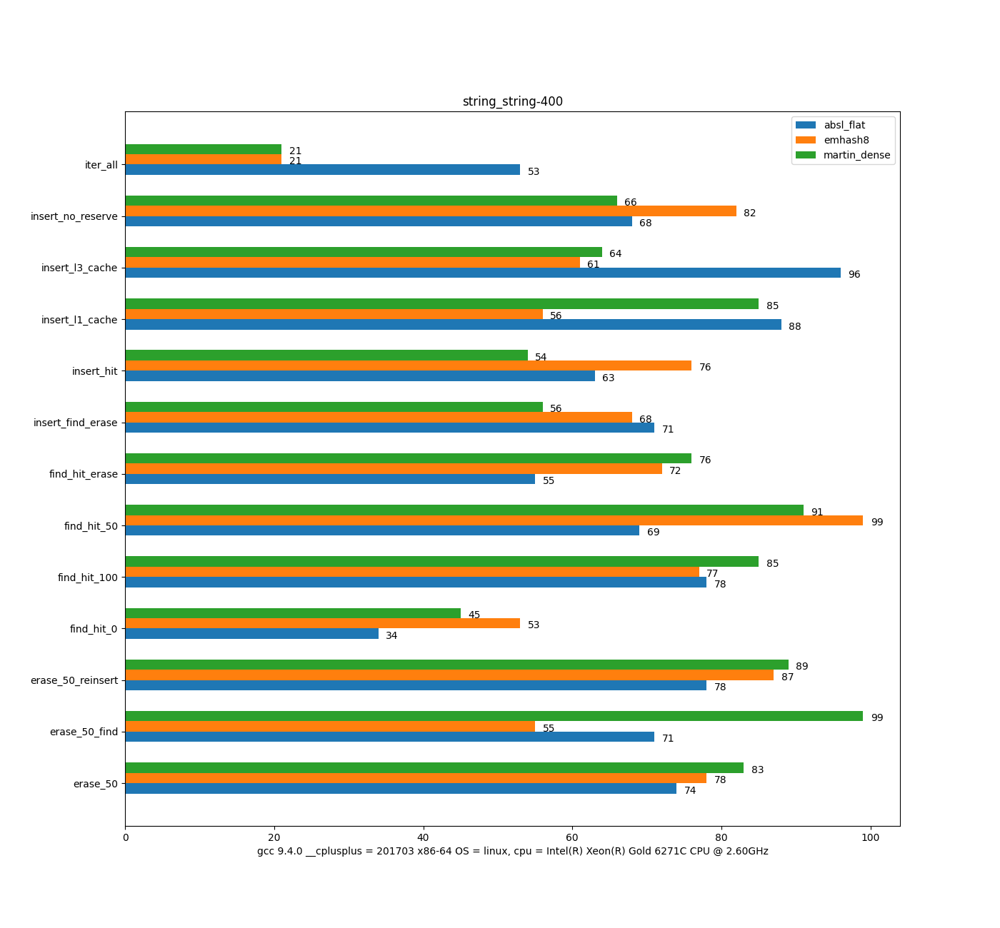
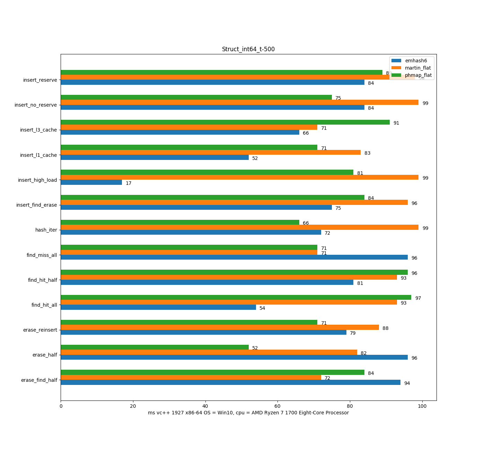
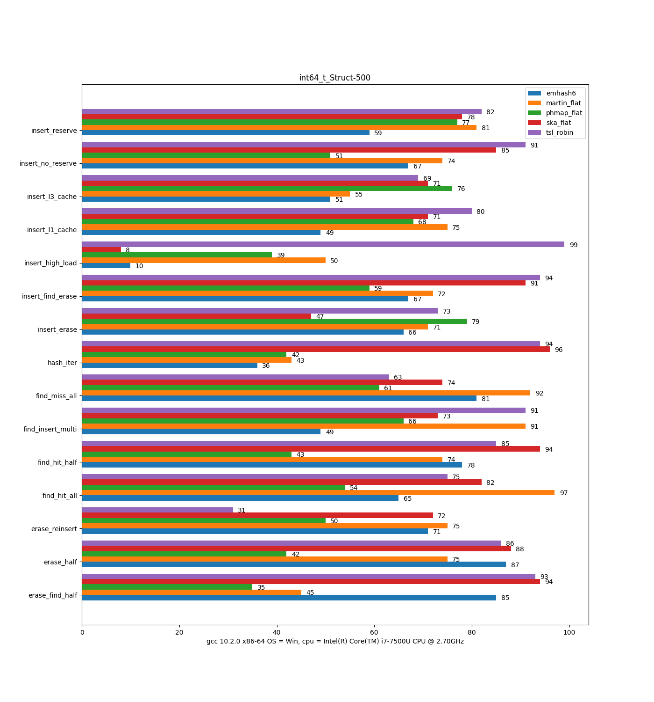
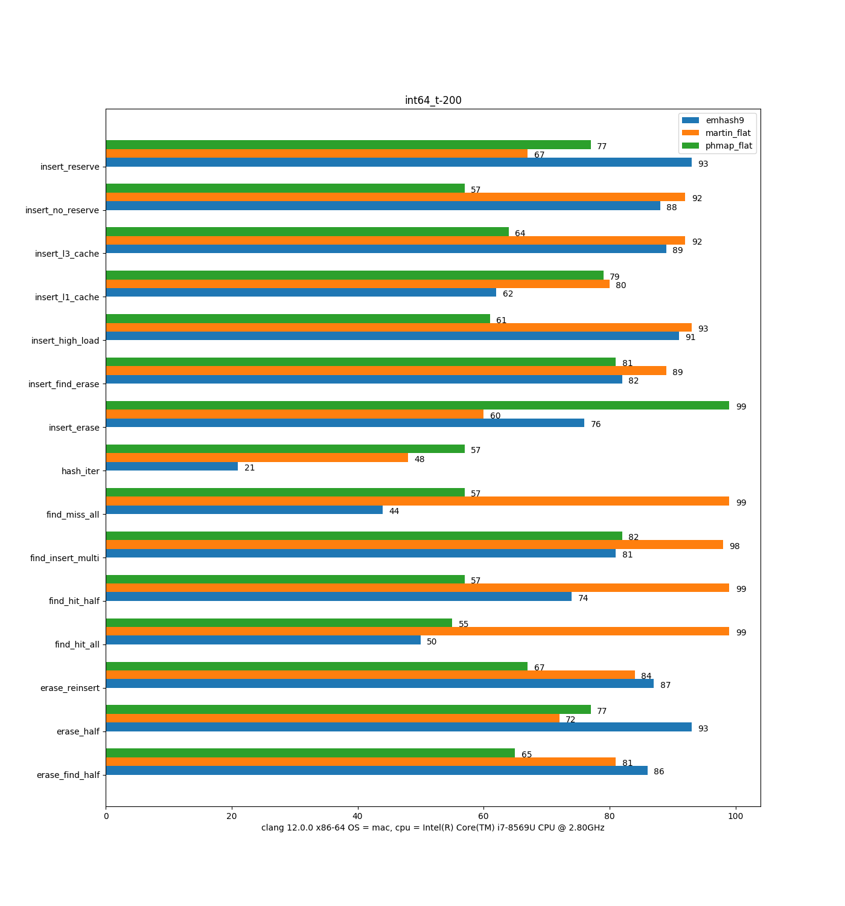

# fast and memory efficient *open addressing c++ flat hash table/map*
   
    third party bechmark from https://martin.ankerl.com/2022/08/27/hashmap-bench-01/
    some feature is not enabled by default and it also can be used by set the compile marco but may loss tiny performance, some featue is conflicted each other or difficlut to be merged into only one head file and so it's distributed in different hash table file. Not all feature can be open in only one file(one hash map).

- **load factor** can be set **0.999** by set marco *EMHASH_HIGH_LOAD == somevalue* (in hash_table[5-8].hpp)

- **head only** support by c++11/14/17/20, interface is highly compatible with std::unordered_map, some new functions added for performance.
    - _erase : return void after erasion
    - shrink_to_fit : shrink fit for saving memory
    - insert_unqiue : insert unique key without finding
    - try_find : return value
    - set_get : once find/insert combined

- **efficient** than other's hash map if key&value is not aligned (sizeof(key) % 8 != sizeof(value) % 8), hash_map<uint64_t, uint32_t> can save 1/3 memoery than hash_map<uint64_t, uint64_t>.

- **lru** marco EMHASH_LRU_SET set. some keys is "frequceny accessed", if keys are not in **main bucket** slot, it'll be swaped with main bucket, and will be probed once.

- **no tombstones**. performance will **not deteriorate** even high frequceny of insertion & erasion.

- **4 different** implementation, for example some case pay attention on finding hot, some focus on finding cold(miss), and others only care about insert or erase and so on.

- **find hit** is fastest at present, fast inserting(**reserve**) and effficient erasion from 6 different benchmarks(4 of them in my bench dir) by my bench

- fully tested on OS(Win, Linux, Mac) with compiler(msvs, clang, gcc) and cpu(AMD, Intel, ARM64).

- many optimization on **integer** key.

# emhash design

- **one array&inline entries** node/entry contains a struct(Key key, size_t bucket, Value value) without separate footprint

- **main bucket** equal to key_hash(key) % size, can not be occupyed(like cockoo hash) and many opertions serarch from it

- **smart collision resolution**, collision node is linked (bucket) like separate channing.
it's not suffered heavily performance loss by primary and secondary clustering.

- **3-way combined** probing used to seach empty slot.
   - linear probing search 2-3 cpu cachelines
   - quadratic probing works after limited linear probing
   - linear search both begin&end with last founded empty slot

- a new linear probing is used (in hash_table5.hpp).
    normaly linear probing is inefficient with high load factor, it use a new 3-way linear
probing strategy to search empty slot. from benchmark even the load factor > 0.9, it's more 2-3 timer fast than traditional seach strategy.

- **second/backup hashing function** if the input hash is bad with a very high collision if the compile marco *EMHASH_SAFE_HASH* is set to defend hash attack(but 10% performance descrease)

- dump hash **collision statics** to analyze cache performance, number of probes for look up of successful/unsuccessful can be showed from dump info.

- finding **64 slots** once using x86 instruction bit scanf(ctz).

- choose *different* hash algorithm by set compile marco *EMHASH_FIBONACCI_HASH* or *EMHASH_IDENTITY_HASH* depend on use case.

- A thirdy party string hash algorithm is used for string key [wyhash](https://github.com/wangyi-fudan/wyhash), which is faster than std::hash implementation

# example

```
        // default constructor: empty map
        emhash5::HashMap<std::string, std::string> m1;
        // list constructor
        emhash5::HashMap<int, std::string> m2 =
        {
            {1, "foo"},
            {3, "bar"},
            {2, "baz"},
        };

        // copy constructor
        emhash5::HashMap<int, std::string> m3 = m2;

        // move constructor
        emhash5::HashMap<int, std::string> m4 = std::move(m2);

        // range constructor
        std::vector<std::pair<std::bitset<8>, int>> v = { {0x12, 1}, {0x01,-1} };
        emhash5::HashMap<std::bitset<8>, double> m5(v.begin(), v.end());

        //Option 1 for a constructor with a custom Key type
        // Define the KeyHash and KeyEqual structs and use them in the template
        emhash5::HashMap<Key, std::string, KeyHash, KeyEqual> m6 = {
            { {"John", "Doe"}, "example"},
            { {"Mary", "Sue"}, "another"}
        };

        //Option 2 for a constructor with a custom Key type
        // Define a const == operator for the class/struct and specialize std::hash
        // structure in the std namespace
        emhash5::HashMap<Foo, std::string> m7 = {
            { Foo(1), "One"}, { 2, "Two"}, { 3, "Three"}
        };

#if CXX20
        struct Goo {int val; };
        auto hash = [](const Goo &g){ return std::hash<int>{}(g.val); };
        auto comp = [](const Goo &l, const Goo &r){ return l.val == r.val; };
        emhash5::HashMap<Goo, double, decltype(hash), decltype(comp)> m8;
#endif

        emhash5::HashMap<int,char> example = {{1,'a'},{2,'b'}};
        for(int x: {2, 5}) {
            if(example.contains(x)) {
                std::cout << x << ": Found\n";
            } else {
                std::cout << x << ": Not found\n";
            }
        }

```

### benchmark

some of benchmark result is uploaded, I use other hash map (martinus, ska, phmap, dense_hash_map ...) source to compile and benchmark.
[] and []

another html result with impressive curve [chartsAll.html](https://github.com/ktprime/emhash/blob/master/bench/tsl_bench/chartsAll.html)
(download all js file in tls_bench dir)
generated by [Tessil](https://tessil.github.io/2016/08/29/benchmark-hopscotch-map.html) benchmark code

txt file result [martin_bench.txt](https://github.com/ktprime/emhash/blob/master/bench/martin_bench.txt) generated by code from
[martin](https://github.com/martinus/map_benchmark)

the benchmark code is some tiny changed for injecting new hash map, the result is not final beacuse it depends on os, cpu, compiler and dataset input.

my result is benched on 3 linux server(amd, intel, arm64), win10 pc/Laptop and apple m1): low is best







# some bad
- it's not a node-based hash map and can't keep the reference stable if insert/erase/rehash happens, use value pointer or choose the other node base hash map.
```
    emhash7:HashMap<int,int> myhash(10);
    myhash[1] = 1;
    auto& myref = myhash[1];//**wrong used here**,  can not keep reference stable
     ....
    auto old = myref ;  // myref maybe be changed and not invalid.

    emhash7:HashMap<int,int> myhash2;
    for (int i = 0; i < 10000; i ++)
        myhash2[rand()] = myhash2[rand()]; // it will be crashed because of rehash, call reserve before or use insert.
 ```

- for very large key-value, use pointer instead of value if you care about memory usage with high frequency of insertion or erasion
```
  emhash7:HashMap<keyT,valueT> myhash; //value is very big, ex sizeof(value) 100 byte

  emhash7:HashMap<keyT,*valueT> myhash2; //new valueT, or use std::shared_ptr<valueT>.

```

- the only known bug as follow example, if erase key/iterator during iteration. one key will be iteraored twice or missed. and fix it can desearse performance 20% or even much more and no good way to fix.

```
    emhash7:HashMap<int,int> myhash;
    //dome some init ...
    for (const auto& it : myhash)
    {
        if (some_key == it.first) {
            myhash.erase(key);  //no any break
       }
       ...
       do_some_more();
    }
    
    //change upper code as follow
    for (auto it = myhash.begin(); it != myhash.end(); it++)
    {
        if (some_key == it.first) {
            it = myhash.erase(it);
       }
       ...
       do_some_more();
    }
    
```

```
     emhash7:HashMap<int,int> myhash = {{1,2},{5,2},};
     auto it = myhash.find(1);
    
     it = map.erase( it );
     map.erase( it++ );// it's error code. use upper line
```
